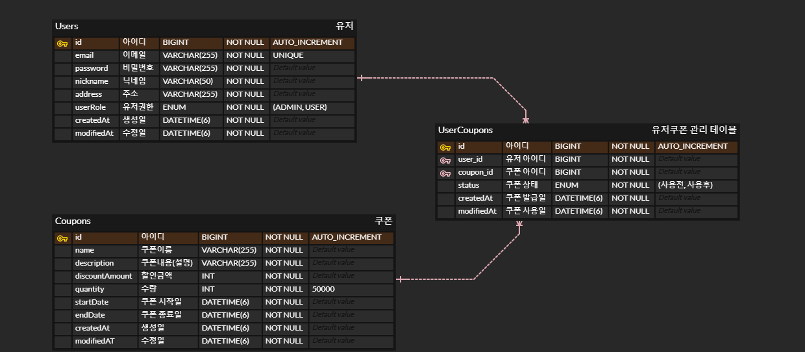

# 🛠️ **Event Coupon Project Documentation**

## 🏁 **프로젝트 소개 및 목표**

> **"이벤트 쿠폰 프로젝트"**
>
> 이 문서는 이벤트 쿠폰 프로젝트의 API 명세서, 주요 기능 및 트러블슈팅 내용을 다룹니다.
>
> 본 팀에서는 기능 중 **동시성 제어 프로젝트**, 도전 기능 중 **배포와 CI / CD**를 목표로 잡고 구현했습니다.
>
> 세부 목표는 다음과 같습니다.
> - **동시성 제어 구현**을 통한 데이터 정합성을 지키기.
> - **CI / CD** 구현을 통한 개발 부터 배포까지 자동화 과정을 구현 해보기.

---

## 📅 **개발 일정 및 역할 분담**

| 항목             | 시작 날짜        |
|----------------|--------------|
| API 구현         | 2025년 3월 25일 |
| 동시성 제어 프로젝트 구현 | 2025년 3월 27일 |
| 배포와 CI / CD 구현 | 2025년 3월 28일 |

> 본 팀에서는 전체 프로젝트를 분할하여 구현하는 것이 아닌, 모든 팀원이 공통된 명세서를 사용하여 각자 프로젝트를 구현하는 것으로 결정하였습니다.
>
> 해당 이유는 다음과 같습니다.
> - 한 팀원만 동시성 제어 프로젝트를 전담한다면, 나머지 팀원들은 동시성 제어 프로젝트에 대해 자세히 배우는 기회가 없을 것이라 생각했습니다.
> - 한 팀원만 배포와 CI / CD 를 전담한다면, 나머지 팀원들은 배포와 CI / CD에 대해 자세히 배우는 기회가 없을 것이라 생각했습니다.
> - 넓은 범위의 API를 구현하고 이후에 동시성 제어 프로젝트 및 배포와 CI / CD를 구성하기에는 한정된 시간을 사용할 경우, 부족하다 생각했습니다.

---

## 🖇️ **KEY Summary**

### 📈 **성능 개선 : Redisson 사용을 통한 동시성 제어 및 처리 성능 향상**

---

1. Lettuce 대신 Redisson 사용을 인하여 **초당 처리 건수 300 -> 500 건으로 증가(Local 환경)**

<details>
<summary>Lettuce 사용한 k6 성능 테스트 결과</summary>

```
scenarios: (100.00%) 1 scenario, 2000 max VUs, 2m0s max duration (incl. graceful stop):
* default: Up to 2000 looping VUs for 1m30s over 2 stages (gracefulRampDown: 30s, gracefulStop: 30s)

INFO[0023] Failed: 409 - {"status":"CONFLICT","code":409,"message":"락을 획득하지 못했습니다. 잠시 후 다시 시도해주세요.","timestamp":"2025-03-26T19:09:17.5833493"}  source=console
INFO[0024] Failed: 409 - {"status":"CONFLICT","code":409,"message":"락을 획득하지 못했습니다. 잠시 후 다시 시도해주세요.","timestamp":"2025-03-26T19:09:18.4310621"}  source=console
INFO[0027] Failed: 409 - {"status":"CONFLICT","code":409,"message":"락을 획득하지 못했습니다. 잠시 후 다시 시도해주세요.","timestamp":"2025-03-26T19:09:21.8517795"}  source=console
INFO[0035] Failed: 409 - {"status":"CONFLICT","code":409,"message":"락을 획득하지 못했습니다. 잠시 후 다시 시도해주세요.","timestamp":"2025-03-26T19:09:29.2747079"}  source=console
INFO[0035] Failed: 409 - {"status":"CONFLICT","code":409,"message":"락을 획득하지 못했습니다. 잠시 후 다시 시도해주세요.","timestamp":"2025-03-26T19:09:29.826392"}  source=console
INFO[0050] Failed: 409 - {"status":"CONFLICT","code":409,"message":"락을 획득하지 못했습니다. 잠시 후 다시 시도해주세요.","timestamp":"2025-03-26T19:09:44.7658323"}  source=console
INFO[0054] Failed: 409 - {"status":"CONFLICT","code":409,"message":"락을 획득하지 못했습니다. 잠시 후 다시 시도해주세요.","timestamp":"2025-03-26T19:09:48.5265837"}  source=console
INFO[0055] Failed: 409 - {"status":"CONFLICT","code":409,"message":"락을 획득하지 못했습니다. 잠시 후 다시 시도해주세요.","timestamp":"2025-03-26T19:09:49.9261035"}  source=console
INFO[0059] Failed: 409 - {"status":"CONFLICT","code":409,"message":"락을 획득하지 못했습니다. 잠시 후 다시 시도해주세요.","timestamp":"2025-03-26T19:09:53.2547779"}  source=console
INFO[0070] Failed: 409 - {"status":"CONFLICT","code":409,"message":"락을 획득하지 못했습니다. 잠시 후 다시 시도해주세요.","timestamp":"2025-03-26T19:10:04.9404414"}  source=console
INFO[0079] Failed: 409 - {"status":"CONFLICT","code":409,"message":"락을 획득하지 못했습니다. 잠시 후 다시 시도해주세요.","timestamp":"2025-03-26T19:10:13.3951531"}  source=console

     ✗ status is 200
      ↳  99% — ✓ 29126 / ✗ 11

     █ setup

       ✓ login success

     checks.........................: 99.96% 29127 out of 29138
     data_received..................: 6.2 MB 64 kB/s
     data_sent......................: 11 MB  116 kB/s
     http_req_blocked...............: avg=19.65µs  min=0s     med=0s     max=2.11ms p(90)=0s      p(95)=0s
     http_req_connecting............: avg=16.74µs  min=0s     med=0s     max=2.11ms p(90)=0s      p(95)=0s
     http_req_duration..............: avg=5.04s    min=5.37ms med=5.35s  max=15.77s p(90)=5.52s   p(95)=5.58s
       { expected_response:true }...: avg=5.04s    min=5.37ms med=5.35s  max=14.79s p(90)=5.51s   p(95)=5.58s
     http_req_failed................: 0.03%  11 out of 29138
     http_req_receiving.............: avg=259.67µs min=0s     med=69.7µs max=2.65ms p(90)=792.6µs p(95)=919.2µs
     http_req_sending...............: avg=5.49µs   min=0s     med=0s     max=4.01ms p(90)=0s      p(95)=0s
     http_req_tls_handshaking.......: avg=0s       min=0s     med=0s     max=0s     p(90)=0s      p(95)=0s
     http_req_waiting...............: avg=5.04s    min=4.85ms med=5.35s  max=15.77s p(90)=5.51s   p(95)=5.58s
     http_reqs......................: 29138  300.788319/s
     iteration_duration.............: avg=6.04s    min=1s     med=6.35s  max=16.77s p(90)=6.52s   p(95)=6.59s
     iterations.....................: 29137  300.777996/s
     vus............................: 170    min=121            max=2000
     vus_max........................: 2000   min=2000           max=2000

                                                                                                                                                                                                                                    
running (1m36.9s), 0000/2000 VUs, 29137 complete and 0 interrupted iterations                                                                                                                                                       
default ✓ [======================================] 0000/2000 VUs  1m30s            
```

</details>

<details>
<summary>Redisson 사용한 k6 성능 테스트 결과</summary>

```
scenarios: (100.00%) 1 scenario, 2000 max VUs, 2m0s max duration (incl. graceful stop):
* default: Up to 2000 looping VUs for 1m30s over 2 stages (gracefulRampDown: 30s, gracefulStop: 30s)


     ✓ status is 200

     █ setup

       ✓ login success

     checks.........................: 100.00% 51902 out of 51902
     data_received..................: 11 MB   106 kB/s
     data_sent......................: 20 MB   192 kB/s
     http_req_blocked...............: avg=6.68µs   min=0s     med=0s    max=26.09ms p(90)=0s      p(95)=0s
     http_req_connecting............: avg=5.15µs   min=0s     med=0s    max=25.09ms p(90)=0s      p(95)=0s
     http_req_duration..............: avg=2.34s    min=2.66ms med=2.49s max=12.86s  p(90)=2.66s   p(95)=2.68s
       { expected_response:true }...: avg=2.34s    min=2.66ms med=2.49s max=12.86s  p(90)=2.66s   p(95)=2.68s
     http_req_failed................: 0.00%   0 out of 51902
     http_req_receiving.............: avg=132.57µs min=0s     med=0s    max=5.09ms  p(90)=513.5µs p(95)=666.89µs
     http_req_sending...............: avg=3.12µs   min=0s     med=0s    max=3.18ms  p(90)=0s      p(95)=0s
     http_req_tls_handshaking.......: avg=0s       min=0s     med=0s    max=0s      p(90)=0s      p(95)=0s
     http_req_waiting...............: avg=2.34s    min=2.53ms med=2.49s max=12.86s  p(90)=2.66s   p(95)=2.68s
     http_reqs......................: 51902   500.857266/s
     iteration_duration.............: avg=3.34s    min=1s     med=3.49s max=13.86s  p(90)=3.66s   p(95)=3.68s
     iterations.....................: 51901   500.847616/s
     vus............................: 1       min=1              max=2000
     vus_max........................: 2000    min=2000           max=2000


running (1m43.6s), 0000/2000 VUs, 51901 complete and 0 interrupted iterations                                                                                                                                                       
default ✓ [======================================] 0000/2000 VUs  1m30s
```

</details>

2. **도입 배경**

- 기존에 사용한 Lettuce는 Redis Lock 구현 시, 직접 스핀락을 만들어 락 획득 시도 시간, 락 보유 시간, 재시도 로직 등을 모두 수동으로 작성해야 했으며, 우선순위(FIFO) 기능이 없어 락을
  공정하게 분배하기 어려운 문제가 존재

- 반면, Redisson은 명확하게 FairLock(공정 락)을 제공해 주어 먼저 요청한 유저가 우선적으로 락을 획득할 수 있게 해주며, 또한 락 획득 시 재시도(tryLock)를 위한 대기 시간(waitTime)
  및 락의 자동 해제 시간(leaseTime)을 API 레벨에서 직접 설정할 수 있어 구현이 간단하고 직관적

- 성능 측면에서도, 직접 구현한 Lettuce 기반의 스핀락 로직보다 내부적으로 최적화된 Redisson이 더 높은 초당 처리량과 낮은 응답 지연을 보여주었음. 특히 대량의 요청이 동시에 몰리는 이벤트성 쿠폰
  발급의 경우, Redisson이 더 적합한 선택

- 또한 Lettuce를 이용해 구현했을 때는 락 획득을 위한 우선순위가 없었기 때문에, 빠르게 쿠폰 발급 버튼을 누른 유저가 대기 큐에 밀려 쿠폰 획득 자체를 실패하는 상황이 간헐적으로 발생했지만, Redisson
  FairLock과 그 안에서 재시도(Retry/Backoff) 전략을 사용한 이후로는 거의 발생하지 않았음

3. **기술적 선택지**

    1. **MySQL Lock**
        - DB의 부하가 증가하고 병목 가능성이 생김
        - Scale Out에서의 문제
        - DeadLock(교착 상태) 위험성이 존재
        - Lock 범위 제어의 유연성이 낮음

    2. **Lettuce**
        - Lettuce를 사용한 Redis Lock 구현 시, 직접 스핀락을 만들어 락 획득 시도 시간, 락 보유 시간, 재시도 로직 등을 모두 수동으로 작성해야 했음
        - 우선순위(FIFO) 기능이 없어 락을 공정하게 분배하기 어려운 문제가 있었음

    3. **Redisson**
        - Redisson은 명확하게 FairLock(공정 락)을 제공해 주어 먼저 요청한 유저가 우선적으로 락을 획득할 수 있게 해줌
        - 락 획득 시 재시도(tryLock)를 위한 대기 시간(waitTime) 및 락의 자동 해제 시간(leaseTime)을 API 레벨에서 직접 설정할 수 있어 구현이 간단하고 직관적

**결론:** MySQL Lock, Lettuce, Redisson에 대한 각각 성능 테스트 실행 후 Redisson의 성능이 다른 두 방법보다 우수 한 것으로 보임

---

## 🏭적용 기술

### 💾 **동시성 제어 처리**

1. **Redis Redisson**
    - **적용 위치**: 캐시 서버
    - **사용 이유**: 선착순 쿠폰 발급과 같은 대용량 트래픽의 동시성을 제어하고 순서를 보장하기 위하여 사용

---

### 🌐 **인프라 및 배포**

1. **Docker**
    - **적용 위치**: 컨테이너 컴포즈를 사용한 모든 서비스 도커 컨테이너화
    - **사용 이유**: 환경 이식성과 배포 속도 개선.

2. **Github Actions**
    - **적용 위치**: CI/CD 파이프라인
    - **사용 이유**: 자동화된 코드 품질 검사와 배포 구현.

3. **AWS ECR, EC2**
    - **적용 위치**: CD 파이프라인
    - **사용 이유**: 배포 구현을 보다 쉽고 자동화 하기 위함.

---

## 주요 기능

### ⌛ **Redis Redisson을 사용한 동시성 제어 처리 구현**

- 대용량 트래픽에 대한 동시성 제어를 처리하기 위해 Redis Redisson을 활용한 쿠폰 발급 처리 구현
- Redis Redisson의 Fair Lock을 통하여 순서가 보장된 동시성 제어 구현

---

### 🏗️ **Docker, Github Actions, AWS를 사용한 배포 및 CI / CD 자동화**

- 배포 및 CI / CD 자동화를 위하여 Docker, Github Actions, AWS 사용
- 특정 브랜치에 push 시, 코드 빌드 및 배포 자동화

---

## 기술적 고도화

<details>
<summary><b>🔐 Lettuce, Redission, MySQL Lock 비교</b></summary>

### 1. 동시성 문제 테스트

- k6 를 사용하여 부하 테스트를 진행하여 실제 DB에 접근할때 동시성 관련 기능을 사용하지 않으면 발생하는 문제 파악

- 초기 Coupon 테이블에 `Quantity` 를 30,000 개로 설정하여서 테스트 진행
- k6 파일 내부 설정의 가상유저는 1,000명 부하 테스트는 30초 동안 진행

#### 실행 결과

```
     ✗ status is 200
      ↳  26% — ✓ 7836 / ✗ 22164

     █ setup

       ✓ login success

     checks.........................: 26.12% 7837 out of 30001
     data_received..................: 7.1 MB 229 kB/s
     data_sent......................: 11 MB  369 kB/s
     http_req_blocked...............: avg=1.32ms   min=0s     med=0s     max=118.68ms p(90)=0s      p(95)=0s
     http_req_connecting............: avg=1.3ms    min=0s     med=0s     max=117.68ms p(90)=0s      p(95)=0s
     http_req_duration..............: avg=15.56ms  min=0s     med=3.75ms max=718.61ms p(90)=8.2ms   p(95)=17.8ms
       { expected_response:true }...: avg=12.73ms  min=1.03ms med=3.63ms max=658.33ms p(90)=6.94ms  p(95)=11.86ms
     http_req_failed................: 73.87% 22164 out of 30001
     http_req_receiving.............: avg=105.25µs min=0s     med=0s     max=21.88ms  p(90)=504.4µs p(95)=594µs
     http_req_sending...............: avg=203.33µs min=0s     med=0s     max=32.35ms  p(90)=0s      p(95)=0s
     http_req_tls_handshaking.......: avg=0s       min=0s     med=0s     max=0s       p(90)=0s      p(95)=0s
     http_req_waiting...............: avg=15.25ms  min=0s     med=3.68ms max=718.61ms p(90)=8.02ms  p(95)=17.46ms
     http_reqs......................: 30001  969.789322/s
     iteration_duration.............: avg=1.01s    min=1s     med=1s     max=1.75s    p(90)=1s      p(95)=1.03s
     iterations.....................: 30000  969.756997/s
     vus............................: 1000   min=1000           max=1000
     vus_max........................: 1000   min=1000           max=1000


running (0m30.9s), 0000/1000 VUs, 30000 complete and 0 interrupted iterations
default ✓ [======================================] 1000 VUs  30s
```

- 총 7836 개의 성공, 22164개의 실패가 나왔다. 실제 DB에는 어떻게 적용되었는지 확인해보자.

먼저 User와 Coupon 은 `다대다` 관계로 중간 관리 테이블을 만들어 주었고 쿠폰 발급시 해당 테이블에 Row 가 1개씩 생성된다.

#### MySQL 콘솔

```mysql
use plus_project;

select count(*)
from user_coupon;
```

해당 SQL 문을 실행한 결과의 이미지이다.


정상적으로 7836 개가 생성된 것을 확인할 수 있었다.

그럼 실제 `Coupons` 테이블의 `Quantity` 컬럼에도 잘 적용되었는지 이미지로 확인해보자


`30000 - 7836 = 22,164` 개가 됐어야 했는데 `25,931`개로 동시성 문제가 확실하게 생겼음을 인지할 수 있었다.


심지어 위의 이미지와 같이 k6 마지막에 오류 발생시 로그를 찍어보았을때 데이터베이스 데드락이 발생하여 제외된 부분 22164 개를 제외하고도,
무려 `25,931 - 22,164 = 3,767`, 즉 `3,767`개의 잘못된 데이터가 생성되고 있음을 확인할 수 있었다.

이제 동시성 문제를 해결해보자.

---

### 동시성 이슈 해결

#### 핵심 목표 :

- 쿠폰 발급 시 동시 다발적 요청으로 인한 데이터 무결성 손상을 방지

- `Lettuce` 라이브러리를 이용해 Redis 락을 직접 구현 (`Redisson` 사용 금지)

기존과 동일하게 `k6`를 사용하여 부하 테스트를 통해서 동시성 제어 성능 테스트를 진행하였다.

```js
export const options = {
    stages: [
        {duration: '10s', target: 2000},
        {duration: '80s', target: 2000},
    ]
};
```

`k6` 옵션을 위와 같이 설정한 이유는 초기에 vus 수를 바로 220 초과해서 띄우면 부하가 걸려서 정상적으로 테스트가 되지 않아서 점점 늘려주는 방식을 선택했다.

- 테스트는 총 5번 정도 진행하였고 각각의 수치를 비교해보자
- `coupons` 테이블의 `quantity` 값은 항상 `50_000`을 고정으로 테스트하였다.
- 락을 획득하지 못했을때의 전략으로는 10초 동안 대기하면서 `100ms` 마다 `Retry` 하는 전략을 선택하였으며, 10초가 지나도 획득하지 못했을 경우엔 예외 처리를 해주었다.
- 테스트 시간 또한 `1분 30초`를 일정하게 유지하였다.

<details>
    <summary>첫번째 테스트</summary>

```
scenarios: (100.00%) 1 scenario, 2000 max VUs, 2m0s max duration (incl. graceful stop):
* default: Up to 2000 looping VUs for 1m30s over 2 stages (gracefulRampDown: 30s, gracefulStop: 30s)

INFO[0023] Failed: 409 - {"status":"CONFLICT","code":409,"message":"락을 획득하지 못했습니다. 잠시 후 다시 시도해주세요.","timestamp":"2025-03-26T19:09:17.5833493"}  source=console
INFO[0024] Failed: 409 - {"status":"CONFLICT","code":409,"message":"락을 획득하지 못했습니다. 잠시 후 다시 시도해주세요.","timestamp":"2025-03-26T19:09:18.4310621"}  source=console
INFO[0027] Failed: 409 - {"status":"CONFLICT","code":409,"message":"락을 획득하지 못했습니다. 잠시 후 다시 시도해주세요.","timestamp":"2025-03-26T19:09:21.8517795"}  source=console
INFO[0035] Failed: 409 - {"status":"CONFLICT","code":409,"message":"락을 획득하지 못했습니다. 잠시 후 다시 시도해주세요.","timestamp":"2025-03-26T19:09:29.2747079"}  source=console
INFO[0035] Failed: 409 - {"status":"CONFLICT","code":409,"message":"락을 획득하지 못했습니다. 잠시 후 다시 시도해주세요.","timestamp":"2025-03-26T19:09:29.826392"}  source=console
INFO[0050] Failed: 409 - {"status":"CONFLICT","code":409,"message":"락을 획득하지 못했습니다. 잠시 후 다시 시도해주세요.","timestamp":"2025-03-26T19:09:44.7658323"}  source=console
INFO[0054] Failed: 409 - {"status":"CONFLICT","code":409,"message":"락을 획득하지 못했습니다. 잠시 후 다시 시도해주세요.","timestamp":"2025-03-26T19:09:48.5265837"}  source=console
INFO[0055] Failed: 409 - {"status":"CONFLICT","code":409,"message":"락을 획득하지 못했습니다. 잠시 후 다시 시도해주세요.","timestamp":"2025-03-26T19:09:49.9261035"}  source=console
INFO[0059] Failed: 409 - {"status":"CONFLICT","code":409,"message":"락을 획득하지 못했습니다. 잠시 후 다시 시도해주세요.","timestamp":"2025-03-26T19:09:53.2547779"}  source=console
INFO[0070] Failed: 409 - {"status":"CONFLICT","code":409,"message":"락을 획득하지 못했습니다. 잠시 후 다시 시도해주세요.","timestamp":"2025-03-26T19:10:04.9404414"}  source=console
INFO[0079] Failed: 409 - {"status":"CONFLICT","code":409,"message":"락을 획득하지 못했습니다. 잠시 후 다시 시도해주세요.","timestamp":"2025-03-26T19:10:13.3951531"}  source=console

     ✗ status is 200
      ↳  99% — ✓ 29126 / ✗ 11

     █ setup

       ✓ login success

     checks.........................: 99.96% 29127 out of 29138
     data_received..................: 6.2 MB 64 kB/s
     data_sent......................: 11 MB  116 kB/s
     http_req_blocked...............: avg=19.65µs  min=0s     med=0s     max=2.11ms p(90)=0s      p(95)=0s
     http_req_connecting............: avg=16.74µs  min=0s     med=0s     max=2.11ms p(90)=0s      p(95)=0s
     http_req_duration..............: avg=5.04s    min=5.37ms med=5.35s  max=15.77s p(90)=5.52s   p(95)=5.58s
       { expected_response:true }...: avg=5.04s    min=5.37ms med=5.35s  max=14.79s p(90)=5.51s   p(95)=5.58s
     http_req_failed................: 0.03%  11 out of 29138
     http_req_receiving.............: avg=259.67µs min=0s     med=69.7µs max=2.65ms p(90)=792.6µs p(95)=919.2µs
     http_req_sending...............: avg=5.49µs   min=0s     med=0s     max=4.01ms p(90)=0s      p(95)=0s
     http_req_tls_handshaking.......: avg=0s       min=0s     med=0s     max=0s     p(90)=0s      p(95)=0s
     http_req_waiting...............: avg=5.04s    min=4.85ms med=5.35s  max=15.77s p(90)=5.51s   p(95)=5.58s
     http_reqs......................: 29138  300.788319/s
     iteration_duration.............: avg=6.04s    min=1s     med=6.35s  max=16.77s p(90)=6.52s   p(95)=6.59s
     iterations.....................: 29137  300.777996/s
     vus............................: 170    min=121            max=2000
     vus_max........................: 2000   min=2000           max=2000

                                                                                                                                                                                                                                    
running (1m36.9s), 0000/2000 VUs, 29137 complete and 0 interrupted iterations                                                                                                                                                       
default ✓ [======================================] 0000/2000 VUs  1m30s            
```

- 총 29126개의 요청 성공, 11개의 요청 실패
- 초당 약 300개의 요청을 처리함

#### 무결성 체크


- `50,000 - 29,126 = 20,874` 로 성공적으로 데이터가 처리되었다.

</details>

<details>
    <summary>두번째 테스트</summary>

```
scenarios: (100.00%) 1 scenario, 2000 max VUs, 2m0s max duration (incl. graceful stop):
* default: Up to 2000 looping VUs for 1m30s over 2 stages (gracefulRampDown: 30s, gracefulStop: 30s)

INFO[0053] Failed: 409 - {"status":"CONFLICT","code":409,"message":"락을 획득하지 못했습니다. 잠시 후 다시 시도해주세요.","timestamp":"2025-03-26T19:16:25.7355326"}  source=console
INFO[0067] Failed: 409 - {"status":"CONFLICT","code":409,"message":"락을 획득하지 못했습니다. 잠시 후 다시 시도해주세요.","timestamp":"2025-03-26T19:16:39.181462"}  source=console
INFO[0077] Failed: 409 - {"status":"CONFLICT","code":409,"message":"락을 획득하지 못했습니다. 잠시 후 다시 시도해주세요.","timestamp":"2025-03-26T19:16:49.3820011"}  source=console
INFO[0078] Failed: 409 - {"status":"CONFLICT","code":409,"message":"락을 획득하지 못했습니다. 잠시 후 다시 시도해주세요.","timestamp":"2025-03-26T19:16:50.0246855"}  source=console
INFO[0092] Failed: 409 - {"status":"CONFLICT","code":409,"message":"락을 획득하지 못했습니다. 잠시 후 다시 시도해주세요.","timestamp":"2025-03-26T19:17:04.6009564"}  source=console

     ✗ status is 200
      ↳  99% — ✓ 31928 / ✗ 5

     █ setup

       ✓ login success

     checks.........................: 99.98% 31929 out of 31934
     data_received..................: 6.8 MB 70 kB/s
     data_sent......................: 12 MB  127 kB/s
     http_req_blocked...............: avg=4.36µs   min=0s     med=0s    max=15.85ms  p(90)=0s       p(95)=0s
     http_req_connecting............: avg=3.6µs    min=0s     med=0s    max=15.85ms  p(90)=0s       p(95)=0s
     http_req_duration..............: avg=4.5s     min=3.64ms med=4.76s max=15.34s   p(90)=5.01s    p(95)=5.23s
       { expected_response:true }...: avg=4.5s     min=3.64ms med=4.76s max=13.95s   p(90)=5.01s    p(95)=5.23s
     http_req_failed................: 0.01%  5 out of 31934
     http_req_receiving.............: avg=224.93µs min=0s     med=0s    max=9.1ms    p(90)=727.94µs p(95)=844.43µs
     http_req_sending...............: avg=1.06µs   min=0s     med=0s    max=540.69µs p(90)=0s       p(95)=0s
     http_req_tls_handshaking.......: avg=0s       min=0s     med=0s    max=0s       p(90)=0s       p(95)=0s
     http_req_waiting...............: avg=4.5s     min=2.72ms med=4.76s max=15.34s   p(90)=5.01s    p(95)=5.23s
     http_reqs......................: 31934  331.021512/s
     iteration_duration.............: avg=5.5s     min=1s     med=5.76s max=16.34s   p(90)=6.01s    p(95)=6.23s
     iterations.....................: 31933  331.011146/s
     vus............................: 40     min=40             max=2000
     vus_max........................: 2000   min=2000           max=2000

                                                                                                                                                                                                                                    
running (1m36.5s), 0000/2000 VUs, 31933 complete and 0 interrupted iterations                                                                                                                                                       
default ✓ [======================================] 0000/2000 VUs  1m30s  
```

- 총 31,928개의 요청 성공, 5개의 실패
- 초당 약 331개의 요청을 처리함

#### 무결성 체크


- `50,000 - 31,928 = 18,072` 로 성공적으로 데이터가 처리되었다.

</details>

<details>
    <summary>세번째 테스트</summary>

```
scenarios: (100.00%) 1 scenario, 2000 max VUs, 2m0s max duration (incl. graceful stop):
* default: Up to 2000 looping VUs for 1m30s over 2 stages (gracefulRampDown: 30s, gracefulStop: 30s)

INFO[0011] Failed: 409 - {"status":"CONFLICT","code":409,"message":"락을 획득하지 못했습니다. 잠시 후 다시 시도해주세요.","timestamp":"2025-03-26T19:21:17.2576664"}  source=console
INFO[0011] Failed: 409 - {"status":"CONFLICT","code":409,"message":"락을 획득하지 못했습니다. 잠시 후 다시 시도해주세요.","timestamp":"2025-03-26T19:21:17.2576664"}  source=console                                                
INFO[0049] Failed: 409 - {"status":"CONFLICT","code":409,"message":"락을 획득하지 못했습니다. 잠시 후 다시 시도해주세요.","timestamp":"2025-03-26T19:21:55.4454327"}  source=console
INFO[0076] Failed: 409 - {"status":"CONFLICT","code":409,"message":"락을 획득하지 못했습니다. 잠시 후 다시 시도해주세요.","timestamp":"2025-03-26T19:22:22.7218031"}  source=console

     ✗ status is 200
      ↳  99% — ✓ 31274 / ✗ 4

     █ setup

       ✓ login success

     checks.........................: 99.98% 31275 out of 31279
     data_received..................: 6.6 MB 69 kB/s
     data_sent......................: 12 MB  125 kB/s
     http_req_blocked...............: avg=5.06µs   min=0s     med=0s     max=14.03ms p(90)=0s      p(95)=0s
     http_req_connecting............: avg=4.29µs   min=0s     med=0s     max=14.03ms p(90)=0s      p(95)=0s
     http_req_duration..............: avg=4.62s    min=3.09ms med=4.91s  max=15.03s  p(90)=5.26s   p(95)=5.4s
       { expected_response:true }...: avg=4.61s    min=3.09ms med=4.91s  max=13.55s  p(90)=5.26s   p(95)=5.4s
     http_req_failed................: 0.01%  4 out of 31279
     http_req_receiving.............: avg=239.29µs min=0s     med=52.6µs max=13ms    p(90)=746.5µs p(95)=896.81µs
     http_req_sending...............: avg=1.79µs   min=0s     med=0s     max=13.53ms p(90)=0s      p(95)=0s
     http_req_tls_handshaking.......: avg=0s       min=0s     med=0s     max=0s      p(90)=0s      p(95)=0s
     http_req_waiting...............: avg=4.61s    min=3.09ms med=4.91s  max=15.03s  p(90)=5.26s   p(95)=5.4s
     http_reqs......................: 31279  324.807172/s
     iteration_duration.............: avg=5.62s    min=1s     med=5.91s  max=16.03s  p(90)=6.26s   p(95)=6.4s
     iterations.....................: 31278  324.796788/s
     vus............................: 65     min=65             max=2000
     vus_max........................: 2000   min=2000           max=2000

                                                                                                                                                                                                                                    
running (1m36.3s), 0000/2000 VUs, 31278 complete and 0 interrupted iterations                                                                                                                                                       
default ✓ [======================================] 0000/2000 VUs  1m30s      
```

- 총 31,274개의 요청 성공, 4개의 실패
- 초당 약 324개의 요청을 처리함

#### 무결성 체크


- `50,000 - 31,274 = 18,726` 로 성공적으로 데이터가 처리되었다.

</details>

<details>
    <summary>네번째 테스트</summary>

```
scenarios: (100.00%) 1 scenario, 2000 max VUs, 2m0s max duration (incl. graceful stop):
* default: Up to 2000 looping VUs for 1m30s over 2 stages (gracefulRampDown: 30s, gracefulStop: 30s)

INFO[0013] Failed: 409 - {"status":"CONFLICT","code":409,"message":"락을 획득하지 못했습니다. 잠시 후 다시 시도해주세요.","timestamp":"2025-03-26T19:25:43.6237933"}  source=console
INFO[0018] Failed: 409 - {"status":"CONFLICT","code":409,"message":"락을 획득하지 못했습니다. 잠시 후 다시 시도해주세요.","timestamp":"2025-03-26T19:25:48.5059818"}  source=console
INFO[0036] Failed: 409 - {"status":"CONFLICT","code":409,"message":"락을 획득하지 못했습니다. 잠시 후 다시 시도해주세요.","timestamp":"2025-03-26T19:26:06.4333486"}  source=console
INFO[0044] Failed: 409 - {"status":"CONFLICT","code":409,"message":"락을 획득하지 못했습니다. 잠시 후 다시 시도해주세요.","timestamp":"2025-03-26T19:26:14.9042193"}  source=console
INFO[0054] Failed: 409 - {"status":"CONFLICT","code":409,"message":"락을 획득하지 못했습니다. 잠시 후 다시 시도해주세요.","timestamp":"2025-03-26T19:26:24.346806"}  source=console
INFO[0074] Failed: 409 - {"status":"CONFLICT","code":409,"message":"락을 획득하지 못했습니다. 잠시 후 다시 시도해주세요.","timestamp":"2025-03-26T19:26:44.4108496"}  source=console
INFO[0078] Failed: 409 - {"status":"CONFLICT","code":409,"message":"락을 획득하지 못했습니다. 잠시 후 다시 시도해주세요.","timestamp":"2025-03-26T19:26:48.8190942"}  source=console
INFO[0089] Failed: 409 - {"status":"CONFLICT","code":409,"message":"락을 획득하지 못했습니다. 잠시 후 다시 시도해주세요.","timestamp":"2025-03-26T19:26:59.545945"}  source=console

     ✗ status is 200
      ↳  99% — ✓ 29980 / ✗ 8

     █ setup

       ✓ login success

     checks.........................: 99.97% 29981 out of 29989
     data_received..................: 6.4 MB 66 kB/s
     data_sent......................: 12 MB  119 kB/s
     http_req_blocked...............: avg=15.74µs  min=0s     med=0s     max=5.81ms  p(90)=0s       p(95)=0s
     http_req_connecting............: avg=13.88µs  min=0s     med=0s     max=5.62ms  p(90)=0s       p(95)=0s
     http_req_duration..............: avg=4.87s    min=3.15ms med=5.11s  max=15.71s  p(90)=5.56s    p(95)=5.66s
       { expected_response:true }...: avg=4.87s    min=3.15ms med=5.11s  max=14.56s  p(90)=5.56s    p(95)=5.66s
     http_req_failed................: 0.02%  8 out of 29989
     http_req_receiving.............: avg=259.83µs min=0s     med=80.9µs max=10.03ms p(90)=789.94µs p(95)=915.1µs
     http_req_sending...............: avg=2.86µs   min=0s     med=0s     max=1ms     p(90)=0s       p(95)=0s
     http_req_tls_handshaking.......: avg=0s       min=0s     med=0s     max=0s      p(90)=0s       p(95)=0s
     http_req_waiting...............: avg=4.87s    min=3.15ms med=5.11s  max=15.71s  p(90)=5.56s    p(95)=5.66s
     http_reqs......................: 29989  309.29088/s
     iteration_duration.............: avg=5.87s    min=1s     med=6.11s  max=16.71s  p(90)=6.56s    p(95)=6.66s
     iterations.....................: 29988  309.280566/s
     vus............................: 1      min=1              max=2000
     vus_max........................: 2000   min=2000           max=2000

                                                                                                                                                                                                                                    
running (1m37.0s), 0000/2000 VUs, 29988 complete and 0 interrupted iterations                                                                                                                                                       
default ✓ [======================================] 0000/2000 VUs  1m30s         
```

- 총 29,980개의 요청 성공, 8개의 실패
- 초당 약 309개의 요청을 처리함

#### 무결성 체크


- `50,000 - 29,980 = 20,020` 로 성공적으로 데이터가 처리되었다.

</details>

<details>
    <summary>마지막 테스트</summary>

```
scenarios: (100.00%) 1 scenario, 2000 max VUs, 2m0s max duration (incl. graceful stop):
* default: Up to 2000 looping VUs for 1m30s over 2 stages (gracefulRampDown: 30s, gracefulStop: 30s)

INFO[0014] Failed: 409 - {"status":"CONFLICT","code":409,"message":"락을 획득하지 못했습니다. 잠시 후 다시 시도해주세요.","timestamp":"2025-03-26T19:29:53.1434112"}  source=console
INFO[0020] Failed: 409 - {"status":"CONFLICT","code":409,"message":"락을 획득하지 못했습니다. 잠시 후 다시 시도해주세요.","timestamp":"2025-03-26T19:29:58.9606357"}  source=console
INFO[0053] Failed: 409 - {"status":"CONFLICT","code":409,"message":"락을 획득하지 못했습니다. 잠시 후 다시 시도해주세요.","timestamp":"2025-03-26T19:30:31.8802574"}  source=console
INFO[0053] Failed: 409 - {"status":"CONFLICT","code":409,"message":"락을 획득하지 못했습니다. 잠시 후 다시 시도해주세요.","timestamp":"2025-03-26T19:30:32.7397963"}  source=console
INFO[0078] Failed: 409 - {"status":"CONFLICT","code":409,"message":"락을 획득하지 못했습니다. 잠시 후 다시 시도해주세요.","timestamp":"2025-03-26T19:30:56.9282381"}  source=console

     ✗ status is 200
      ↳  99% — ✓ 30226 / ✗ 5

     █ setup

       ✓ login success

     checks.........................: 99.98% 30227 out of 30232
     data_received..................: 6.4 MB 66 kB/s
     data_sent......................: 12 MB  120 kB/s
     http_req_blocked...............: avg=7.02µs   min=0s     med=0s      max=1.5ms   p(90)=0s      p(95)=0s
     http_req_connecting............: avg=5.31µs   min=0s     med=0s      max=1.15ms  p(90)=0s      p(95)=0s
     http_req_duration..............: avg=4.83s    min=2.53ms med=5.3s    max=15.51s  p(90)=5.49s   p(95)=5.52s
       { expected_response:true }...: avg=4.83s    min=2.53ms med=5.3s    max=14.34s  p(90)=5.49s   p(95)=5.52s
     http_req_failed................: 0.01%  5 out of 30232
     http_req_receiving.............: avg=251.73µs min=0s     med=65.95µs max=1.81ms  p(90)=765.3µs p(95)=902.5µs
     http_req_sending...............: avg=2.63µs   min=0s     med=0s      max=651.8µs p(90)=0s      p(95)=0s
     http_req_tls_handshaking.......: avg=0s       min=0s     med=0s      max=0s      p(90)=0s      p(95)=0s
     http_req_waiting...............: avg=4.83s    min=2.53ms med=5.3s    max=15.51s  p(90)=5.49s   p(95)=5.52s
     http_reqs......................: 30232  311.204811/s
     iteration_duration.............: avg=5.83s    min=1s     med=6.3s    max=16.52s  p(90)=6.49s   p(95)=6.52s
     iterations.....................: 30231  311.194518/s
     vus............................: 3      min=3              max=2000
     vus_max........................: 2000   min=2000           max=2000

                                                                                                                                                                                                                                    
running (1m37.1s), 0000/2000 VUs, 30231 complete and 0 interrupted iterations                                                                                                                                                       
default ✓ [======================================] 0000/2000 VUs  1m30s        
```

- 총 30,226개의 요청 성공, 5개의 실패
- 초당 약 311개의 요청을 처리함

#### 무결성 체크


- `50,000 - 30,226 = 19,774` 로 성공적으로 데이터가 처리되었다.

</details>

### 결과 합산

- 최대 요청 성공 수 : 31,928개
- 최대 요청 실패 수 : 11개

- 총 요청 성공 수 : 152,534개
- 총 요청 실패 수 : 33개

- 평균 요청 성공 수 : 30,506.8개
- 평균 요청 실패 수 : 6.6개

<br/>

#### 성공 비율

- 요청 성공률 : 약 `99.98%`
- 요청 실패율 : 약 `0.02%`
- 데이터 무결성 : `100%`

매우 준수한 결과를 나타낸것 같다.
목표로 하였던 데이터 무결성을 지켜내었기에 만족스러운 결과이다.

---

### 동시성 이슈 해결

<details>
    <summary>Redisson  사용 (Local 환경)</summary>

#### `Lettuce`가 아닌 `Redisson`을 사용한 이유

기존에 사용한 `Lettuce`는 `Redis Lock` 구현 시, 내가 직접 스핀락을 만들어 락 획득 시도 시간, 락 보유 시간, 재시도 로직 등을 모두 수동으로 작성해야 했으며, 우선순위(FIFO) 기능이 없어
락을 공정하게 분배하기 어려운 문제가 있었다.

반면, `Redisson`은 명확하게 `FairLock(공정 락)`을 제공해 주어 먼저 요청한 유저가 우선적으로 락을 획득할 수 있게 해주며, 또한 락 획득 시 재시도(tryLock)를 위한 대기 시간(
waitTime) 및 락의 자동 해제 시간(leaseTime)을 API 레벨에서 직접 설정할 수 있어 구현이 간단하고 직관적이었다.

성능 측면에서도, 직접 구현한 `Lettuce` 기반의 스핀락 로직보다 내부적으로 최적화된 `Redisson`이 더 높은 초당 처리량과 낮은 응답 지연을 보여주었다. 특히 대량의 요청이 동시에 몰리는 이벤트성 쿠폰
발급의 경우, `Redisson`이 더 적합한 선택이었다.

또한 `Lettuce`를 이용해 구현했을 때는 락 획득을 위한 우선순위가 없었기 때문에, 빠르게 쿠폰 발급 버튼을 누른 유저가 대기 큐에 밀려 쿠폰 획득 자체를 실패하는 상황이 간헐적으로 발생했지만,
`Redisson FairLock`과 그 안에서 `재시도(Retry/Backoff)` 전략을 사용한 이후로는 거의 발생하지 않았다.

그럼 이제 어느정도의 성능 차이가 있는지 테스트 결과를 통해 비교해보자

### 성능 테스트 및 비교 (Redisson 적용)

#### 테스트 조건

- k6를 이용해 10초 동안 가상 유저를 점진적으로 2,000명까지 증가시킨 후,
  이후 80초 동안 2,000명의 가상 유저가 계속 요청을 보내도록 설정하였다.

- coupons 테이블의 쿠폰 수량은 100,000개로 설정하여 테스트를 진행하였다.

```
scenarios: (100.00%) 1 scenario, 2000 max VUs, 2m0s max duration (incl. graceful stop):
* default: Up to 2000 looping VUs for 1m30s over 2 stages (gracefulRampDown: 30s, gracefulStop: 30s)


     ✓ status is 200

     █ setup

       ✓ login success

     checks.........................: 100.00% 51902 out of 51902
     data_received..................: 11 MB   106 kB/s
     data_sent......................: 20 MB   192 kB/s
     http_req_blocked...............: avg=6.68µs   min=0s     med=0s    max=26.09ms p(90)=0s      p(95)=0s
     http_req_connecting............: avg=5.15µs   min=0s     med=0s    max=25.09ms p(90)=0s      p(95)=0s
     http_req_duration..............: avg=2.34s    min=2.66ms med=2.49s max=12.86s  p(90)=2.66s   p(95)=2.68s
       { expected_response:true }...: avg=2.34s    min=2.66ms med=2.49s max=12.86s  p(90)=2.66s   p(95)=2.68s
     http_req_failed................: 0.00%   0 out of 51902
     http_req_receiving.............: avg=132.57µs min=0s     med=0s    max=5.09ms  p(90)=513.5µs p(95)=666.89µs
     http_req_sending...............: avg=3.12µs   min=0s     med=0s    max=3.18ms  p(90)=0s      p(95)=0s
     http_req_tls_handshaking.......: avg=0s       min=0s     med=0s    max=0s      p(90)=0s      p(95)=0s
     http_req_waiting...............: avg=2.34s    min=2.53ms med=2.49s max=12.86s  p(90)=2.66s   p(95)=2.68s
     http_reqs......................: 51902   500.857266/s
     iteration_duration.............: avg=3.34s    min=1s     med=3.49s max=13.86s  p(90)=3.66s   p(95)=3.68s
     iterations.....................: 51901   500.847616/s
     vus............................: 1       min=1              max=2000
     vus_max........................: 2000    min=2000           max=2000

                                                                                                                                                                                                                                    
running (1m43.6s), 0000/2000 VUs, 51901 complete and 0 interrupted iterations                                                                                                                                                       
default ✓ [======================================] 0000/2000 VUs  1m30s                    
```

### DB 데이터 결과


- 쿠폰 `100,000`개 중에서 발급 성공한 `51,901`개를 빼면 남은 수량 `48,099`개로 데이터 무결성이 지켜졌다.
- 초당 처리 가능한 요청도 약 500 개 정도로 `Lettuce`를 이용한 직접 구현에 비해 성능이 크게 향상되었다.
- `응답 지연(p95)`도 4초 이내로 안정적인 응답 속도를 보여주었다.

### 결론

최종적으로 Redisson FairLock + 재시도(Retry/Backoff) 전략을 통해:

- 쿠폰 발급의 데이터 무결성 보장 (과발급 문제 완전 해결)
- 락 충돌(409 Conflict) 문제 최소화 (거의 발생하지 않음)
- 높은 처리량 및 안정적인 응답 속도 확보
- 간결하고 직관적인 코드 구현

의 네 가지 핵심 목표를 성공적으로 달성했다.

단, 이벤트 참여자의 절대적인 FIFO 순서를 반드시 보장해야 하는 비즈니스 상황이라면, 현재의 재시도 방식은 대기 순번을 다시 뒤로 밀리게 하므로, 쿠폰 수량 내에 신청했던 유저 중 일부가 받지 못하는 가능성이
있다. 따라서, 이 부분에 대한 추가적인 전략이나 보완책이 필요할 수 있다는 점도 확인했다.

</details>

<details>
    <summary>Redisson 사용 (Docker Container)</summary>

- 이번엔 내 로컬에 띄워준 Docker Container 에서의 실행 결과를 테스트 해보았다.

### 성능 테스트 및 비교 (Redisson 적용, Docker Container)

#### 테스트 조건

- k6를 이용해 10초 동안 가상 유저를 점진적으로 2,000명까지 증가시킨 후, 이후 80초 동안 2,000명의 가상 유저가 계속 요청을 보내도록 설정하였다.
- coupons 테이블의 쿠폰 수량은 100,000개로 설정하여 테스트를 진행하였다.

```
scenarios: (100.00%) 1 scenario, 2000 max VUs, 2m0s max duration (incl. graceful stop):
* default: Up to 2000 looping VUs for 1m30s over 2 stages (gracefulRampDown: 30s, gracefulStop: 30s)


     ✓ status is 200

     █ setup

       ✓ login success

     checks.........................: 100.00% 32378 out of 32378
     data_received..................: 6.9 MB  68 kB/s
     data_sent......................: 12 MB   122 kB/s
     http_req_blocked...............: avg=29.81µs min=0s      med=0s    max=4.88ms  p(90)=0s      p(95)=511.31µs
     http_req_connecting............: avg=27.62µs min=0s      med=0s    max=1.18ms  p(90)=0s      p(95)=504.51µs
     http_req_duration..............: avg=4.41s   min=12.08ms med=4.55s max=15.19s  p(90)=4.93s   p(95)=5.03s
       { expected_response:true }...: avg=4.41s   min=12.08ms med=4.55s max=15.19s  p(90)=4.93s   p(95)=5.03s
     http_req_failed................: 0.00%   0 out of 32378
     http_req_receiving.............: avg=69.54µs min=0s      med=0s    max=18.28ms p(90)=515.2µs p(95)=524.7µs
     http_req_sending...............: avg=3.49µs  min=0s      med=0s    max=1.49ms  p(90)=0s      p(95)=0s
     http_req_tls_handshaking.......: avg=0s      min=0s      med=0s    max=0s      p(90)=0s      p(95)=0s
     http_req_waiting...............: avg=4.41s   min=12.08ms med=4.55s max=15.19s  p(90)=4.93s   p(95)=5.03s
     http_reqs......................: 32378   319.432191/s
     iteration_duration.............: avg=5.41s   min=1.05s   med=5.55s max=16.19s  p(90)=5.93s   p(95)=6.03s
     iterations.....................: 32377   319.422325/s
     vus............................: 1       min=1              max=2000
     vus_max........................: 2000    min=2000           max=2000

                                                                                                                                                                                                                                    
running (1m41.4s), 0000/2000 VUs, 32377 complete and 0 interrupted iterations                                                                                                                                                       
default ✓ [======================================] 0000/2000 VUs  1m30s     
```

### DB 데이터 결과


- 쿠폰 `100,000`개 중에서 발급 성공한 `32,377`개를 빼면 남은 수량 `67,623`개로 데이터 무결성이 지켜졌다.
- 초당 처리 가능한 요청도 약 319 개 정도로 `Local`환경에서의 초당 처리 요청인 500개 정도에서 대략 200개 정도 차이가 난다.
- `응답 지연(p95)`도 6초 이내로 확실히 `Local` 보단 느린 응답 속도를 보여주었다.
- 이번 과제에선 indexing 과 Caching 적용을 해주지 않아서 만약 성능 개선을 좀 더 한다면 해당 부분의 내용으로 성능 개선을 해줄 수 있을 것이다.

### Local vs Docker 비교

```
Local 의 결과
http_req_waiting...............: avg=2.34s    min=2.53ms med=2.49s max=12.86s  p(90)=2.66s   p(95)=2.68s
http_reqs......................: 51902   500.857266/s
iteration_duration.............: avg=3.34s    min=1s     med=3.49s max=13.86s  p(90)=3.66s   p(95)=3.68s
iterations.....................: 51901   500.847616/s

Docker Container 의 결과
http_req_waiting...............: avg=4.41s   min=12.08ms med=4.55s max=15.19s  p(90)=4.93s   p(95)=5.03s
http_reqs......................: 32378   319.432191/s
iteration_duration.............: avg=5.41s   min=1.05s   med=5.55s max=16.19s  p(90)=5.93s   p(95)=6.03s
iterations.....................: 32377   319.422325/s
```

</details>

<details>
    <summary>MySQL 사용(Local 환경)</summary>

- MySQL(비관적 락 / Exclusive Lock) 의 장점
    - 구현이 단순하고 직관적이다
    - 일관성 강화 & 트랜잭션 연동이 가능하다.
    - 추가 인프라가 불필요하다.
- 단점
    - DB의 부하 증가 & 병목 가능성이 생긴다.
    - 스케일 아웃(확장성) 문제
    - DeadLock(교착상태) 위험성이 있다.
    - 락 범위 제어의 유연성이 낮다.

### 성능 테스트 및 비교 (MySQL Lock 적용)

#### 테스트 조건

- k6를 이용해 10초 동안 가상 유저를 점진적으로 2,000명까지 증가시킨 후,
  이후 80초 동안 2,000명의 가상 유저가 계속 요청을 보내도록 설정하였다.

- coupons 테이블의 쿠폰 수량은 100,000개로 설정하여 테스트를 진행하였다.

```
scenarios: (100.00%) 1 scenario, 2000 max VUs, 2m0s max duration (incl. graceful stop):
* default: Up to 2000 looping VUs for 1m30s over 2 stages (gracefulRampDown: 30s, gracefulStop: 30s)


     ✓ status is 200

     █ setup

       ✓ login success

     checks.........................: 100.00% 53456 out of 53456
     data_received..................: 11 MB   121 kB/s
     data_sent......................: 21 MB   223 kB/s
     http_req_blocked...............: avg=7.35µs   min=0s     med=0s    max=6.71ms  p(90)=0s      p(95)=0s
     http_req_connecting............: avg=5.25µs   min=0s     med=0s    max=6.71ms  p(90)=0s      p(95)=0s
     http_req_duration..............: avg=2.24s    min=1.55ms med=2.37s max=3.53s   p(90)=2.46s   p(95)=2.56s
       { expected_response:true }...: avg=2.24s    min=1.55ms med=2.37s max=3.53s   p(90)=2.46s   p(95)=2.56s
     http_req_failed................: 0.00%   0 out of 53456
     http_req_receiving.............: avg=127.19µs min=0s     med=0s    max=15.03ms p(90)=513.2µs p(95)=663.15µs
     http_req_sending...............: avg=3.42µs   min=0s     med=0s    max=1.5ms   p(90)=0s      p(95)=0s
     http_req_tls_handshaking.......: avg=0s       min=0s     med=0s    max=0s      p(90)=0s      p(95)=0s
     http_req_waiting...............: avg=2.24s    min=1.55ms med=2.37s max=3.53s   p(90)=2.46s   p(95)=2.56s
     http_reqs......................: 53456   570.509159/s
     iteration_duration.............: avg=3.24s    min=1s     med=3.37s max=4.53s   p(90)=3.46s   p(95)=3.56s
     iterations.....................: 53455   570.498487/s
     vus............................: 520     min=104            max=2000
     vus_max........................: 2000    min=2000           max=2000

                                                                                                                                                                                                                                    
running (1m33.7s), 0000/2000 VUs, 53455 complete and 0 interrupted iterations                                                                                                                                                       
default ✓ [======================================] 0000/2000 VUs  1m30s                            
```

### DB 데이터 결과


- 쿠폰 `100,000`개 중에서 발급 성공한 `53,455`개를 빼면 남은 수량 `46,545`개로 데이터 무결성이 지켜졌다.
- 초당 처리 가능한 요청도 약 570 개 정도로 생각보다 성능이 좋게 나와서 놀랏다.
- `응답 지연(p95)`도 4초 이내로 안정적인 응답 속도를 보여주었다.

### 결론

생각보다 성능이 잘나와서 예상과는 달랐다.
아마 로컬환경에서 테스트 한 것들이라서 그런 것이라 생각이 되었다.
정확한 측정을 위해서는 CI/CD 구현 후에 AWS에서 띄운 상태에서 테스트를 시도해 봐야 알 것 같다.

- 소규모 트래픽 혹은 별도 분산 락 서버를 구성하기 어려운 환경에서는 `MySQL`의 비관적 락이 간단하고 직관적인 해법이 되는 것 같다.
- 대규모 트래픽, 높은 동시성, 장시간 락 유지가 필요한 상황에서는 DB가 병목 지점이 될 수 있어 `Redis`나 다른 분산 락 시스템이 더 적합하다고 한다.
- 운영 환경에 따라 트랜잭션 설계(락 획득 범위, 시점, 순서 등)에 주의하여 데드락 위험과 락 경합을 최소화 시켜야 한다.

</details>

<details>
    <summary>MySQL 사용(Docker Container)</summary>

- 마지막으로 로컬에 띄워준 Docker Container 에서의 실행 결과를 `MySQL Lock` 방식을 사용해 테스트 해보았다.

```
scenarios: (100.00%) 1 scenario, 2000 max VUs, 2m0s max duration (incl. graceful stop):
* default: Up to 2000 looping VUs for 1m30s over 2 stages (gracefulRampDown: 30s, gracefulStop: 30s)

     ✓ status is 200

     █ setup

       ✓ login success

     checks.........................: 100.00% 29156 out of 29156
     data_received..................: 6.2 MB  65 kB/s
     data_sent......................: 11 MB   118 kB/s
     http_req_blocked...............: avg=29.25µs min=0s      med=0s    max=6.07ms p(90)=0s      p(95)=506.12µs
     http_req_connecting............: avg=26.24µs min=0s      med=0s    max=6.07ms p(90)=0s      p(95)=0s
     http_req_duration..............: avg=5.02s   min=10.62ms med=5.19s max=6.47s  p(90)=5.81s   p(95)=5.96s
       { expected_response:true }...: avg=5.02s   min=10.62ms med=5.19s max=6.47s  p(90)=5.81s   p(95)=5.96s
     http_req_failed................: 0.00%   0 out of 29156
     http_req_receiving.............: avg=67.33µs min=0s      med=0s    max=2.97ms p(90)=515.2µs p(95)=525.2µs
     http_req_sending...............: avg=5.4µs   min=0s      med=0s    max=1.02ms p(90)=0s      p(95)=0s
     http_req_tls_handshaking.......: avg=0s      min=0s      med=0s    max=0s     p(90)=0s      p(95)=0s
     http_req_waiting...............: avg=5.02s   min=10.09ms med=5.19s max=6.47s  p(90)=5.81s   p(95)=5.96s
     http_reqs......................: 29156   304.394069/s
     iteration_duration.............: avg=6.02s   min=1.05s   med=6.19s max=7.47s  p(90)=6.81s   p(95)=6.96s
     iterations.....................: 29155   304.383629/s
     vus............................: 293     min=185            max=2000
     vus_max........................: 2000    min=2000           max=2000

                                                                                                                                                                                                                                    
running (1m35.8s), 0000/2000 VUs, 29155 complete and 0 interrupted iterations                                                                                                                                                       
default ✓ [======================================] 0000/2000 VUs  1m30s           
```

### DB 데이터 결과


- 쿠폰 `100,000`개 중에서 발급 성공한 `29,155`개를 빼면 남은 수량 `70,845`개로 데이터 무결성이 지켜졌다.
- 초당 처리 가능한 요청은 약 304 개로 Local 환경에서 돌렸던 약 570 개보다는 확실히 낮은 성능을 나타낸다.
- 응답 지연(p95)도 6.96s, 약 7초 이내로 이 부분도 Local 환경보다는 느린 편으로 나타났다.

### Local vs Docker 비교

```
Local 에서의 결과
http_req_waiting...............: avg=2.24s    min=1.55ms med=2.37s max=3.53s   p(90)=2.46s   p(95)=2.56s
http_reqs......................: 53456   570.509159/s
iteration_duration.............: avg=3.24s    min=1s     med=3.37s max=4.53s   p(90)=3.46s   p(95)=3.56s
iterations.....................: 53455   570.498487/s

Docker Container 의 결과
http_req_waiting...............: avg=5.02s   min=10.09ms med=5.19s max=6.47s  p(90)=5.81s   p(95)=5.96s
http_reqs......................: 29156   304.394069/s
iteration_duration.............: avg=6.02s   min=1.05s   med=6.19s max=7.47s  p(90)=6.81s   p(95)=6.96s
iterations.....................: 29155   304.383629/s
```

</details>

</details>

---

<details>
<summary><b>🏗️배포 및 CI / CD 구현을 통한 자동화</b></summary>

## CI/CD

### CI/CD 플로우

1. docker-compose 를 사용하여 MySQL, Reddis, Spring-Boot 컨테이너들을 하나로 통합하여 관리
2. GitHub Actions 기능을 사용하여 빌드 및 테스트 후에 배포
3. ECR 을 사용하여 docker-compose 에서 생성한 이미지 저장
4. EC2 를 사용하여 ECR 에 저장되어 있는 이미지를 PULL 한 후에 docker-compose 를 사용하여 EC2 환경에 docker container 를 띄워서 사용

### 요구 사항

- [x] 코드 변경 시, 자동으로 빌드 및 테스트를 수행하는 CI 파이프라인을 구성하세요.
    - GitHub Actions 사용
- [x] 테스트가 성공적으로 완료되면 프로덕션에 자동 배포되도록 CD 파이프라인을 설정하세요.
    - ECR 에 docker-compose 결과 이미지 업로드, 이후에 EC2 에서 ECR 에 저장되어있는 docker-compose 파일을 가져와서 빌드

### 조건

- **CI/CD 관련 이슈를 해결하기 위해 다음을 고려해야 합니다.**
    - [x] 테스트 커버리지 강화: 배포 전 코드 안정성을 높이기 위해 테스트 커버리지를 강화해야 합니다.
        - GitHub Actions 에서 build&test / build&deploy 과정을 나누어서 build&test 과정이 성공시에 deploy 까지 넘어가도록 설정
    - [x] 보안: 배포 과정에서 민감한 정보나 설정이 노출되지 않도록 보안 설정을 철저히 관리합니다.
        - 민감한 정보나 설정이 노출되지 않게 GitHub Actions 의 환경변수 기능을 사용하여 application.yml 파일등을 모두 환경 변수 처리하여 노출되지 않도록 하였음

### ECR 이미지


### Git Actions 이미지


- 성공적으로 test 코드 및 docker 작동 이후에
- deploy 과정이 실행된다.
- 마지막으로 EC2 인스턴스 내부에서 Nginx 라이브러리를 사용해 내가 구매한 Route 53 의 Domain 과 EC2 를 연결시키고, Https 설정까지 마친 후에 Nginx 설정을 통해 EC2 인스턴스에서
  실행 중인 Spring-Boot 서버를 연결시켰다.

[Https 프로젝트 헬스 체크 링크](https://plus-project.wjswlgh96.com/api/v1/health)

</details>

___

## 📄 **API 명세서**

<details>
<summary><b>🔑 로그인</b></summary>

| 상태 | 메서드  | 엔드포인트                 | 기능   | 접근 권한 | 인증 필요 | 요청 본문                                                                                    | 응답                                                                                                   |
|----|------|-----------------------|------|-------|-------|------------------------------------------------------------------------------------------|------------------------------------------------------------------------------------------------------|
| 완료 | POST | `/api/v1/auth/signup` | 회원가입 | ALL   | NO    | `{ "email": "string", "password": "string", "nickname": "string", "address": "string" }` | `{ "status": "OK", "code": 200, "message": "회원 가입에 성공했습니다.", "data": null }`                         |
| 완료 | POST | `/api/v1/auth/signin` | 로그인  | ALL   | NO    | `{ "email": "string", "password": "string" }`                                            | `{ "status": "OK", "code": 200, "message": "로그인에 성공했습니다.", "data": { "accessToken": "tokenData" } }` |

</details>

<details>
<summary><b>👤 유저</b></summary>

| 상태 | 메서드 | 엔드포인트                          | 기능        | 접근 권한 | 인증 필요 | 요청 본문                                                  | 응답                                                                              |
|----|-----|--------------------------------|-----------|-------|-------|--------------------------------------------------------|---------------------------------------------------------------------------------|
| 완료 | PUT | `/api/v1/users/{userId}/admin` | 어드민 권한 발급 | ADMIN | YES   | `{ "userRole": "string" }` (Path: `userId`: long)      | `{ "status": "OK", "code": 200, "message": "유저 권한 변경에 성공했습니다.", "data": null }` |
| 완료 | PUT | `/api/v1/users`                | 비밀번호 변경   | ALL   | YES   | `{ "oldPassword": "string", "newPassword": "string" }` | `{ "status": "OK", "code": 200, "message": "비밀번호 변경에 성공했습니다.", "data": null }`  |

</details>

<details>
<summary><b>🎫 쿠폰</b></summary>

| 상태 | 메서드  | 엔드포인트                 | 기능    | 접근 권한 | 인증 필요 | 요청 본문                                                                                                                                                 | 응답                                                                                                                                                                                                                          |
|----|------|-----------------------|-------|-------|-------|-------------------------------------------------------------------------------------------------------------------------------------------------------|-----------------------------------------------------------------------------------------------------------------------------------------------------------------------------------------------------------------------------|
| 완료 | POST | `/api/v1/coupons`     | 쿠폰 생성 | ADMIN | YES   | `{ "name": "string", "description": "string", "discountAmount": "int", "quantity": "int", "startDate": "LocalDateTime", "endDate": "LocalDateTime" }` | (응답 데이터 미완성으로 생략)                                                                                                                                                                                                           |
| 완료 | POST | `/api/v1/user-coupon` | 쿠폰 발급 | USER  | YES   | 없음                                                                                                                                                    | `{ "status": "OK", "code": 200, "message": "쿠폰 발급에 성공했습니다.", "data": null }`                                                                                                                                                |
| 완료 | GET  | `/api/v1/user-coupon` | 쿠폰 조회 | USER  | YES   | 없음                                                                                                                                                    | `{ "status": "OK", "code": 200, "message": "쿠폰 조회에 성공했습니다.", "data": [ { "id": 1, "name": "쿠폰이름", "description": "쿠폰설명", "discountAmount": 1000, "startDate": "2025-03-24 00:00", "endDate": "2025-03-25 00:00" }, ... ] }` |

</details>

---

## 🔃 **ERD (Entity-Relationship Diagram)**



---

## ✅ **Test Coverage**


---

## 🔗 **참조**

[팀 노션 페이지](https://www.notion.so/teamsparta/15-1c02dc3ef51480ec9ba6dd2676aaea26?p=1c32dc3ef51480429c27ca61069c0a58&pm=s)

## 👥 **팀 구성**

| 전지호                                       | 정청원                                      | 전탁                                    | 박세진                                     | 노현수                                         |
|-------------------------------------------|------------------------------------------|---------------------------------------|-----------------------------------------|---------------------------------------------|
| 팀장                                        | 팀원                                       | 팀원                                    | 팀원                                      | 팀원                                          |
| [wjswlgh96](https://github.com/wjswlgh96) | [ChungWon](https://github.com/ChungwonJ) | [JeonTak](https://github.com/JEONTAK) | [plusmate](https://github.com/plusmate) | [2024122601](https://github.com/2024122601) |

---