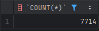
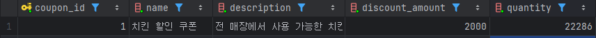

## 동시성 이슈를 검증할 수 있는 테스트

### 1. local test 결과
[ConcurrencyTest](src/test/java/com/plusproject/load/ConcurrencyTest.java)에서 실행

#### 설정
    
- 수량 - 10000개
- 쓰레드 - 10개
- 테스트 횟수 - 1000번
- 결과
```
성공 카운트 : 1273
예외 카운트 : 8727
실제 발급된 전체 쿠폰 개수 : 1273
쿠폰 테이블에서 예상한 발급된 쿠폰 개수 : 1001
```
결과를 보면 총 성공 개수와 실제 발급된 쿠폰 개수는 1273개로 동일하다.
하지만 실제 쿠폰 테이블에서 발급된 수량은 1001개로 약 250개의 차이를 보인다.
또한, 쿠폰 테이블의 수량을 업데이트하기위한 요청이 동시에 들어오면서, 데드락이 발생하는 문제도 발견되었다.
본인의 예상으로는 예외 카운트 중 대부분이 데드락으로 인한 에러일 가능성이 많다고 생각한다.

### 2. k6 테스트 결과
테스트코드를 직접 구현해보는것과 더불어,
k6 부하테스트 툴을 사용하여 실제 Application이 동작하였을때의 테스트도 진행해 보았다.
[load_test](load_test.js)를 참고하면 된다.

```
  █ TOTAL RESULTS

    checks_total.......................: 6099   256.837294/s
    checks_succeeded...................: 48.61% 2965 out of 6099
    checks_failed......................: 51.38% 3134 out of 6099

    ✓ login success
    ✗ status is 200
      ↳  48% — ✓ 2964 / ✗ 3134

    HTTP
    http_req_duration.......................................................: avg=14.43ms min=0s     med=6ms    max=427.35ms p(90)=12.2ms  p(95)=15.92ms
      { expected_response:true }............................................: avg=9.46ms  min=3.44ms med=4.83ms max=424.88ms p(90)=10.61ms p(95)=13ms
    http_req_failed.........................................................: 51.38% 3134 out of 6099
    http_reqs...............................................................: 6099   256.837294/s

    EXECUTION
    iteration_duration......................................................: avg=1.72s   min=1s     med=1.28s  max=7.02s    p(90)=2.52s   p(95)=5.49s
    iterations..............................................................: 6098   256.795182/s
    vus.....................................................................: 37     min=37           max=500
    vus_max.................................................................: 500    min=500          max=500

    NETWORK
    data_received...........................................................: 1.5 MB 63 kB/s
    data_sent...............................................................: 2.0 MB 83 kB/s

```

총 6099개 중 2964개가 성공하였다고 나와있다.

발급된 쿠폰의 개수를 
```sql
SELECT COUNT(*) FROM user_coupon
```
를 통해 확인해보면, 


처럼 2964개가 되어있다.

하지만 쿠폰 테이블에서 해당 쿠폰의 수량을 확인해보면


과 같이 7955개로 나와있다. (초기값은 10000개로 설정하였다.)
10000 - 7955 = 2045이므로, 해당 쿠폰은 2045개만 발급되었다고 생각하지만, 실제로는 2964개로, 약 900개가 더 발급 된 것을 확인할 수 있다.
이를 통해 동시성 테스트 시 문제가 발생할 수 있다는 것을 알 수 있다.

---

## Redis Lettuce

### Lettuce 구현
[RedisLettuceService](src/main/java/com/plusproject/domain/redis/service/RedisLettuceService.java), [RedisLettuceRepository](src/main/java/com/plusproject/domain/redis/repository/RedisLettuceRepository.java)

- 먼저 레디스를 도커를 통해 실행시켜주었다.
- acquireLock -> lock 획득을 시도하는 메서드
  - 만약 정한 시간 안에 lock 획득을 성공하면, redis에 해당 lock을 저장하고, 획득 성공을 반환한다.
  - 만약 실패하면, null을 반환해 실패했다는 것을 알려준다.
- releaseLock -> lock을 해제하는 메서드
  - lock을 얻은 후 실행이 완료되면 lock을 해제해야 한다.
  - 해당 메서드를 통해 redis 메모리에서 해당 값을 찾아 제거하면 lock이 해제하는 것.
- executeWithLock -> lock을 통해 실행하는 메서드
  - 먼저 redis 메모리에 저장하기위해 lock:coupon:아이디 값을 String으로 생성한다.
  - 해당 값을 사용해 lock을 획득할 수 있는 지 체크하고, 획득 하였다면, value를 return 받는다.
  - 실패한다면 value = null이다.
  - 만약 value가 null이면 lock 획득에 실패했다는 예외처리를 해준다.
  - lock을 획득했다면, task를 실행하고, 마지막에 lock을 해제 해준다.

### UserCouponService 수정
[UserCouponService](src/main/java/com/plusproject/domain/usercoupon/service/UserCouponService.java)

- 서비스에서 쿠폰을 발급받는 메서드인 issuedCoupon 메서드를 수정해준다.
- redisLettuceService를 통해 lock 획득 이후 실행할 수 있게 끔 코드를 수정해 주었다.
- 추가로, 해당 메서드는 발급받은 쿠폰의 id를 반환해주어야 하기 때문에, 해당 값을 반환해준다.


### 결과
```
INFO[0011] Failed: 409 - {"status":"CONFLICT","code":409,"message":"락 획득에 실패했습니다.","timestamp":"2025-03-27T10:31:48.4537876"}  source=console
INFO[0013] Failed: 409 - {"status":"CONFLICT","code":409,"message":"락 획득에 실패했습니다.","timestamp":"2025-03-27T10:31:50.2757519"}  source=console


  █ TOTAL RESULTS

    checks_total.......................: 7955   150.081395/s
    checks_succeeded...................: 99.97% 7953 out of 7955
    checks_failed......................: 0.02%  2 out of 7955

    ✓ login success
    ✗ status is 200
      ↳  99% — ✓ 7952 / ✗ 2

    HTTP
    http_req_duration.......................................................: avg=9.36s  min=316.01ms med=11.43s max=15.79s p(90)=11.73s p(95)=11.74s
      { expected_response:true }............................................: avg=9.36s  min=316.01ms med=11.43s max=15.79s p(90)=11.73s p(95)=11.74s
    http_req_failed.........................................................: 0.02%  2 out of 7955
    http_reqs...............................................................: 7955   150.081395/s

    EXECUTION
    iteration_duration......................................................: avg=10.36s min=1.4s     med=12.43s max=16.79s p(90)=12.73s p(95)=12.74s
    iterations..............................................................: 7954   150.062529/s
    vus.....................................................................: 2      min=2         max=2000
    vus_max.................................................................: 2000   min=2000      max=2000

    NETWORK
    data_received...........................................................: 1.7 MB 32 kB/s
    data_sent...............................................................: 2.7 MB 52 kB/s
```
k6 load_test를 돌린 결과이다.
두번의 락 획득 실패로인한 실패 이외에는 총 7952개의 쿠폰 발급이 이루어졌다.
발급 된 쿠폰의 개수를
```sql
SELECT COUNT(*) FROM user_coupon
```
통해 확인해보면,


다음과 같이 7952개의 쿠폰 발급이 정상적으로 이루어진것을 알 수 있다.

쿠폰 수량의 변화를 확인해보면,


다음과 같이 2048개가 남아있다.(설정 수량은 10000개 이다.)
10000 - 2048 = 7952이므로, 동시성 처리가 제대로 된 것을 확인할 수 있다.

## AOP를 이용한 Lock 구현

### 구현 위치
[DistributedLock](src/main/java/com/plusproject/common/annotation/DistributedLock.java)
[DistributedLockAspect](src/main/java/com/plusproject/common/aop/DistributedLockAspect.java)

### 내용
- DistributedLock 어노테이션을 만들어 해당 어노테이션이 달려 있는 컨트롤러나 메서드 실행 시 Lettuce를 이용한 동시성 처리가 될 수 있게 수정 하였다.
- DistributedLockAspect를 통해 DistributedLock이 달려 있는 컨트롤러나 메서드 실행시 어떤 것을 할지 구현함.
  - 1. DistributedLock 어노테이션을 가져와 키값을 설정하고, 대기 시간 및 lock 점유 시간을 설정한 뒤 기존 RedisLettuce Service에 있던 executeWithLock() 메서드를 aspect 메서드 안에 넣어 주었다.
  - 2. 이때, 기존 방식에서는 대기시간 및 lock 점유 시간을 상수로 설정하여 관리한 반면, 해당 방식에서는 어노테이션을 붙일 때 대기시간과 lock 점유 시간을 설정할 수 있도록 구현하였다.
  - 3. UserCouponService에서 기존 쿠폰을 발급 받을때는 try-finally 및 executeWithLock()메서드를 사용하여 lock을 관리하였는데, 해당 방식 적용 이후에는 기존 서비스 코드와 같이 구현할 수 있어 try-finally와 같은 블록을 제거하여 가독성이 높아진다는 장점을 배울 수 있었다.
- 주의점으로는 #request.couponId 처럼 파라미터 이름을 정확히 설정해야 한다는 점이 있다.

### 결과
```
  █ TOTAL RESULTS

    checks_total.......................: 8174   141.186606/s
    checks_succeeded...................: 90.94% 7434 out of 8174
    checks_failed......................: 9.05%  740 out of 8174

    ✓ login success
    ✗ status is 200
      ↳  90% — ✓ 7433 / ✗ 740

    HTTP
    http_req_duration.......................................................: avg=9.06s  min=7.23ms med=9.9s  max=20.24s p(90)=13.47s p(95)=19.53s
      { expected_response:true }............................................: avg=8.28s  min=7.23ms med=9.88s max=19.87s p(90)=10.1s  p(95)=10.94s
    http_req_failed.........................................................: 9.05%  740 out of 8174
    http_reqs...............................................................: 8174   141.186606/s

    EXECUTION
    iteration_duration......................................................: avg=10.06s min=1s     med=10.9s max=21.24s p(90)=14.47s p(95)=20.53s
    iterations..............................................................: 8173   141.169334/s
    vus.....................................................................: 11     min=11          max=2000
    vus_max.................................................................: 2000   min=2000        max=2000

    NETWORK
    data_received...........................................................: 1.8 MB 30 kB/s
    data_sent...............................................................: 2.8 MB 48 kB/s
```
다음과 같이 총 8174개의 시도중 7433개가 성공하고 740개는 실패하였다.
실패한 이유는 lock을 획득하기 위해 기다리는 시간을 10초로 설정하였는데, 해당 시간을 넘어가 lock 획득에 실패하여 에러가 발생하였기 때문이다.
따라서 성공한 7433개가 제대로 성공했는지 확인해보고자 한다.
발급 된 쿠폰의 개수를
```sql
SELECT COUNT(*) FROM user_coupon
```
통해 확인해보면,


와 같이 7433개가 동일하게 발급된 것을 알 수 있다.

쿠폰 수량의 변화를 확인해보면,


다음과 같이 2567개가 남아있다.(설정 수량은 10000개 이다.)
10000 - 2567 = 7433이므로, 동시성 처리가 제대로 된 것을 확인할 수 있다.

---

## Redisson을 이용한 Lock 구현

### 구현 위치
[RedissonDistributedLock](src/main/java/com/plusproject/common/annotation/RedissonDistributedLock.java)
[RedissonDistributedLockAspect](src/main/java/com/plusproject/common/aop/RedissonDistributedLockAspect.java)

### 내용
- 위 AOP 구현에 추가적으로 Redisson을 사용하여 구현하였다.
- Redisson을 사용하는 이유
  - 분산 lock 구현이 쉽다.
    - Lettuce는 분산 lock을 직접 구현해 주어야 한다.
    - 하지만 Redisson은 RLock 인터페이스틀 통해 분산 lock을 제공한다.
  - FairLock을 제공한다
    - 동시성 처리에서 특정 상황에서의 중요한 부분은 바로 순서 보장이다.
    - Lock을 받고 동시성 처리가 가능해도, 순서가 보장이 되지 않는다면, 이는 비즈니스적 관점에서는 크나큰 문제점이 된다.
    - 하지만 FairLock을 사용한다면 위 문제점을 해결할 수 있다.
    - FairLock은 Lcok을 요청한 순서대로 클라이언트가 Lock을 획득할 수 있도록 보장해준다.
    - 따라서 동시성 처리 및 순서 보장까지 가능하기 때문에 매우 장점이 될 수 있다.

### 결과
```
  █ TOTAL RESULTS

    checks_total.......................: 7913   153.787675/s
    checks_succeeded...................: 97.49% 7715 out of 7913
    checks_failed......................: 2.50%  198 out of 7913

    ✓ login success
    ✗ status is 200
      ↳  97% — ✓ 7714 / ✗ 198

    HTTP
    http_req_duration.......................................................: avg=9.14s  min=134.63ms med=10.09s max=20.21s p(90)=11.88s p(95)=12.06s
      { expected_response:true }............................................: avg=8.86s  min=134.63ms med=10.08s max=13.29s p(90)=11.84s p(95)=11.98s
    http_req_failed.........................................................: 2.50%  198 out of 7913
    http_reqs...............................................................: 7913   153.787675/s

    EXECUTION
    iteration_duration......................................................: avg=10.14s min=1.13s    med=11.09s max=21.44s p(90)=12.88s p(95)=13.06s
    iterations..............................................................: 7912   153.76824/s
    vus.....................................................................: 92     min=92          max=2000
    vus_max.................................................................: 2000   min=2000        max=2000

    NETWORK
    data_received...........................................................: 1.7 MB 33 kB/s
    data_sent...............................................................: 2.7 MB 53 kB/s

```
다음과 같이 총 7913개의 시도중 7714개가 성공하고 198개는 실패하였다.
실패한 이유는 lock을 획득하기 위해 기다리는 시간을 10초로 설정하였는데, 해당 시간을 넘어가 lock 획득에 실패하여 에러가 발생하였기 때문이다.
따라서 성공한 7714개가 제대로 성공했는지 확인해보고자 한다.
발급 된 쿠폰의 개수를
```sql
SELECT COUNT(*) FROM user_coupon
```
통해 확인해보면,



와 같이 7714개가 동일하게 발급된 것을 알 수 있다.

쿠폰 수량의 변화를 확인해보면,



다음과 같이 22286개가 남아있다.(설정 수량은 30000개 이다.)
30000 - 22286 = 7714이므로, 동시성 처리가 제대로 된 것을 확인할 수 있다.

---

## 순서 보장 테스트

### Lettuce를 사용한 테스트
```
2025-03-27T15:19:11.740+09:00  INFO 28484 --- [plus-project] [io-8080-exec-24] c.p.common.aop.DistributedLockAspect     : Lock acquired for key: 21bb
2025-03-27T15:19:11.746+09:00  INFO 28484 --- [plus-project] [io-8080-exec-24] c.p.common.aop.DistributedLockAspect     : Lock released for key: 21bb
2025-03-27T15:19:11.770+09:00  INFO 28484 --- [plus-project] [o-8080-exec-154] c.p.common.aop.DistributedLockAspect     : Lock acquired for key: 2358
2025-03-27T15:19:11.776+09:00  INFO 28484 --- [plus-project] [o-8080-exec-154] c.p.common.aop.DistributedLockAspect     : Lock released for key: 2358
2025-03-27T15:19:11.849+09:00  INFO 28484 --- [plus-project] [io-8080-exec-14] c.p.common.aop.DistributedLockAspect     : Lock acquired for key: 2289
2025-03-27T15:19:11.856+09:00  INFO 28484 --- [plus-project] [io-8080-exec-14] c.p.common.aop.DistributedLockAspect     : Lock released for key: 2289
2025-03-27T15:19:11.877+09:00  INFO 28484 --- [plus-project] [o-8080-exec-113] c.p.common.aop.DistributedLockAspect     : Lock acquired for key: 2088
2025-03-27T15:19:11.883+09:00  INFO 28484 --- [plus-project] [o-8080-exec-113] c.p.common.aop.DistributedLockAspect     : Lock released for key: 2088
2025-03-27T15:19:11.951+09:00  INFO 28484 --- [plus-project] [o-8080-exec-184] c.p.common.aop.DistributedLockAspect     : Lock acquired for key: 22c3
2025-03-27T15:19:11.958+09:00  INFO 28484 --- [plus-project] [o-8080-exec-184] c.p.common.aop.DistributedLockAspect     : Lock released for key: 22c3
2025-03-27T15:19:11.985+09:00  INFO 28484 --- [plus-project] [io-8080-exec-87] c.p.common.aop.DistributedLockAspect     : Lock acquired for key: 2031
2025-03-27T15:19:11.991+09:00  INFO 28484 --- [plus-project] [io-8080-exec-87] c.p.common.aop.DistributedLockAspect     : Lock released for key: 2031
2025-03-27T15:19:12.062+09:00  INFO 28484 --- [plus-project] [io-8080-exec-90] c.p.common.aop.DistributedLockAspect     : Lock acquired for key: 2183
2025-03-27T15:19:12.069+09:00  INFO 28484 --- [plus-project] [io-8080-exec-90] c.p.common.aop.DistributedLockAspect     : Lock released for key: 2183
2025-03-27T15:19:12.169+09:00  INFO 28484 --- [plus-project] [o-8080-exec-182] c.p.common.aop.DistributedLockAspect     : Lock acquired for key: 2065
2025-03-27T15:19:12.176+09:00  INFO 28484 --- [plus-project] [o-8080-exec-182] c.p.common.aop.DistributedLockAspect     : Lock released for key: 2065
2025-03-27T15:19:12.275+09:00  WARN 28484 --- [plus-project] [o-8080-exec-177] c.p.common.aop.DistributedLockAspect     : Failed to acquire lock for key: lock:coupon:#request.couponId
2025-03-27T15:19:12.276+09:00  INFO 28484 --- [plus-project] [nio-8080-exec-1] c.p.common.aop.DistributedLockAspect     : Lock acquired for key: 22fe
2025-03-27T15:19:12.283+09:00  INFO 28484 --- [plus-project] [nio-8080-exec-1] c.p.common.aop.DistributedLockAspect     : Lock released for key: 22fe
2025-03-27T15:19:12.384+09:00  INFO 28484 --- [plus-project] [io-8080-exec-57] c.p.common.aop.DistributedLockAspect     : Lock acquired for key: 20ab
2025-03-27T15:19:12.391+09:00  INFO 28484 --- [plus-project] [io-8080-exec-57] c.p.common.aop.DistributedLockAspect     : Lock released for key: 20ab
2025-03-27T15:19:12.492+09:00  INFO 28484 --- [plus-project] [o-8080-exec-189] c.p.common.aop.DistributedLockAspect     : Lock acquired for key: 22de
2025-03-27T15:19:12.498+09:00  INFO 28484 --- [plus-project] [o-8080-exec-189] c.p.common.aop.DistributedLockAspect     : Lock released for key: 22de
2025-03-27T15:19:12.599+09:00  WARN 28484 --- [plus-project] [io-8080-exec-48] c.p.common.aop.DistributedLockAspect     : Failed to acquire lock for key: lock:coupon:#request.couponId
2025-03-27T15:19:12.600+09:00  INFO 28484 --- [plus-project] [o-8080-exec-114] c.p.common.aop.DistributedLockAspect     : Lock acquired for key: 21f8
2025-03-27T15:19:12.607+09:00  INFO 28484 --- [plus-project] [o-8080-exec-114] c.p.common.aop.DistributedLockAspect     : Lock released for key: 21f8
2025-03-27T15:19:12.709+09:00  INFO 28484 --- [plus-project] [o-8080-exec-103] c.p.common.aop.DistributedLockAspect     : Lock acquired for key: 219a
2025-03-27T15:19:12.715+09:00  INFO 28484 --- [plus-project] [o-8080-exec-103] c.p.common.aop.DistributedLockAspect     : Lock released for key: 219a
2025-03-27T15:19:12.816+09:00  WARN 28484 --- [plus-project] [io-8080-exec-99] c.p.common.aop.DistributedLockAspect     : Failed to acquire lock for key: lock:coupon:#request.couponId
2025-03-27T15:19:12.818+09:00  INFO 28484 --- [plus-project] [io-8080-exec-75] c.p.common.aop.DistributedLockAspect     : Lock acquired for key: 2398
2025-03-27T15:19:12.824+09:00  INFO 28484 --- [plus-project] [io-8080-exec-75] c.p.common.aop.DistributedLockAspect     : Lock released for key: 2398
2025-03-27T15:19:12.926+09:00  INFO 28484 --- [plus-project] [o-8080-exec-153] c.p.common.aop.DistributedLockAspect     : Lock acquired for key: 2436
2025-03-27T15:19:12.933+09:00  INFO 28484 --- [plus-project] [o-8080-exec-153] c.p.common.aop.DistributedLockAspect     : Lock released for key: 2436
2025-03-27T15:19:13.027+09:00  INFO 28484 --- [plus-project] [io-8080-exec-85] c.p.common.aop.DistributedLockAspect     : Lock acquired for key: 227b
2025-03-27T15:19:13.034+09:00  INFO 28484 --- [plus-project] [io-8080-exec-85] c.p.common.aop.DistributedLockAspect     : Lock released for key: 227b
2025-03-27T15:19:13.140+09:00  INFO 28484 --- [plus-project] [io-8080-exec-96] c.p.common.aop.DistributedLockAspect     : Lock acquired for key: 2411
2025-03-27T15:19:13.146+09:00  INFO 28484 --- [plus-project] [io-8080-exec-96] c.p.common.aop.DistributedLockAspect     : Lock released for key: 2411
2025-03-27T15:19:13.248+09:00  INFO 28484 --- [plus-project] [o-8080-exec-150] c.p.common.aop.DistributedLockAspect     : Lock acquired for key: 2343
2025-03-27T15:19:13.256+09:00  INFO 28484 --- [plus-project] [o-8080-exec-150] c.p.common.aop.DistributedLockAspect     : Lock released for key: 2343
2025-03-27T15:19:13.350+09:00  INFO 28484 --- [plus-project] [io-8080-exec-67] c.p.common.aop.DistributedLockAspect     : Lock acquired for key: 23f1
2025-03-27T15:19:13.357+09:00  INFO 28484 --- [plus-project] [io-8080-exec-67] c.p.common.aop.DistributedLockAspect     : Lock released for key: 23f1
2025-03-27T15:19:13.466+09:00  INFO 28484 --- [plus-project] [io-8080-exec-37] c.p.common.aop.DistributedLockAspect     : Lock acquired for key: 2322
2025-03-27T15:19:13.472+09:00  INFO 28484 --- [plus-project] [io-8080-exec-37] c.p.common.aop.DistributedLockAspect     : Lock released for key: 2322
2025-03-27T15:19:13.575+09:00  INFO 28484 --- [plus-project] [io-8080-exec-94] c.p.common.aop.DistributedLockAspect     : Lock acquired for key: 2176
2025-03-27T15:19:13.582+09:00  INFO 28484 --- [plus-project] [io-8080-exec-94] c.p.common.aop.DistributedLockAspect     : Lock released for key: 2176
2025-03-27T15:19:13.683+09:00  INFO 28484 --- [plus-project] [io-8080-exec-11] c.p.common.aop.DistributedLockAspect     : Lock acquired for key: 21af
2025-03-27T15:19:13.690+09:00  INFO 28484 --- [plus-project] [io-8080-exec-11] c.p.common.aop.DistributedLockAspect     : Lock released for key: 21af
2025-03-27T15:19:13.792+09:00  INFO 28484 --- [plus-project] [o-8080-exec-176] c.p.common.aop.DistributedLockAspect     : Lock acquired for key: 2330
2025-03-27T15:19:13.799+09:00  INFO 28484 --- [plus-project] [o-8080-exec-176] c.p.common.aop.DistributedLockAspect     : Lock released for key: 2330
```

### Redisson을 사용한 테스트
```
2025-03-27T15:14:54.350+09:00  INFO 27928 --- [plus-project] [io-8080-exec-77] c.p.c.aop.RedissonDistributedLockAspect  : Lock acquired for key: 2584
2025-03-27T15:14:54.356+09:00  INFO 27928 --- [plus-project] [io-8080-exec-77] c.p.c.aop.RedissonDistributedLockAspect  : Lock released for key: 2584
2025-03-27T15:14:54.357+09:00  INFO 27928 --- [plus-project] [o-8080-exec-145] c.p.c.aop.RedissonDistributedLockAspect  : Lock acquired for key: 2585
2025-03-27T15:14:54.362+09:00  INFO 27928 --- [plus-project] [o-8080-exec-145] c.p.c.aop.RedissonDistributedLockAspect  : Lock released for key: 2585
2025-03-27T15:14:54.363+09:00  INFO 27928 --- [plus-project] [io-8080-exec-21] c.p.c.aop.RedissonDistributedLockAspect  : Lock acquired for key: 2586
2025-03-27T15:14:54.368+09:00  INFO 27928 --- [plus-project] [io-8080-exec-21] c.p.c.aop.RedissonDistributedLockAspect  : Lock released for key: 2586
2025-03-27T15:14:54.368+09:00  INFO 27928 --- [plus-project] [io-8080-exec-28] c.p.c.aop.RedissonDistributedLockAspect  : Lock acquired for key: 2587
2025-03-27T15:14:54.374+09:00  INFO 27928 --- [plus-project] [io-8080-exec-28] c.p.c.aop.RedissonDistributedLockAspect  : Lock released for key: 2587
2025-03-27T15:14:54.374+09:00  INFO 27928 --- [plus-project] [nio-8080-exec-8] c.p.c.aop.RedissonDistributedLockAspect  : Lock acquired for key: 2588
2025-03-27T15:14:54.379+09:00  INFO 27928 --- [plus-project] [nio-8080-exec-8] c.p.c.aop.RedissonDistributedLockAspect  : Lock released for key: 2588
2025-03-27T15:14:54.380+09:00  INFO 27928 --- [plus-project] [o-8080-exec-146] c.p.c.aop.RedissonDistributedLockAspect  : Lock acquired for key: 2589
2025-03-27T15:14:54.385+09:00  INFO 27928 --- [plus-project] [o-8080-exec-146] c.p.c.aop.RedissonDistributedLockAspect  : Lock released for key: 2589
2025-03-27T15:14:54.386+09:00  INFO 27928 --- [plus-project] [o-8080-exec-116] c.p.c.aop.RedissonDistributedLockAspect  : Lock acquired for key: 258a
2025-03-27T15:14:54.391+09:00  INFO 27928 --- [plus-project] [o-8080-exec-116] c.p.c.aop.RedissonDistributedLockAspect  : Lock released for key: 258a
2025-03-27T15:14:54.391+09:00  INFO 27928 --- [plus-project] [io-8080-exec-22] c.p.c.aop.RedissonDistributedLockAspect  : Lock acquired for key: 258b
2025-03-27T15:14:54.396+09:00  INFO 27928 --- [plus-project] [io-8080-exec-22] c.p.c.aop.RedissonDistributedLockAspect  : Lock released for key: 258b
2025-03-27T15:14:54.397+09:00  INFO 27928 --- [plus-project] [io-8080-exec-59] c.p.c.aop.RedissonDistributedLockAspect  : Lock acquired for key: 258c
2025-03-27T15:14:54.402+09:00  INFO 27928 --- [plus-project] [io-8080-exec-59] c.p.c.aop.RedissonDistributedLockAspect  : Lock released for key: 258c
2025-03-27T15:14:54.403+09:00  INFO 27928 --- [plus-project] [io-8080-exec-17] c.p.c.aop.RedissonDistributedLockAspect  : Lock acquired for key: 258d
2025-03-27T15:14:54.408+09:00  INFO 27928 --- [plus-project] [io-8080-exec-17] c.p.c.aop.RedissonDistributedLockAspect  : Lock released for key: 258d
2025-03-27T15:14:54.408+09:00  INFO 27928 --- [plus-project] [o-8080-exec-147] c.p.c.aop.RedissonDistributedLockAspect  : Lock acquired for key: 258e
2025-03-27T15:14:54.413+09:00  INFO 27928 --- [plus-project] [o-8080-exec-147] c.p.c.aop.RedissonDistributedLockAspect  : Lock released for key: 258e
2025-03-27T15:14:54.414+09:00  INFO 27928 --- [plus-project] [o-8080-exec-148] c.p.c.aop.RedissonDistributedLockAspect  : Lock acquired for key: 258f
2025-03-27T15:14:54.419+09:00  INFO 27928 --- [plus-project] [o-8080-exec-148] c.p.c.aop.RedissonDistributedLockAspect  : Lock released for key: 258f
2025-03-27T15:14:54.419+09:00  INFO 27928 --- [plus-project] [io-8080-exec-92] c.p.c.aop.RedissonDistributedLockAspect  : Lock acquired for key: 2590
2025-03-27T15:14:54.424+09:00  INFO 27928 --- [plus-project] [io-8080-exec-92] c.p.c.aop.RedissonDistributedLockAspect  : Lock released for key: 2590
2025-03-27T15:14:54.425+09:00  INFO 27928 --- [plus-project] [io-8080-exec-29] c.p.c.aop.RedissonDistributedLockAspect  : Lock acquired for key: 2591
2025-03-27T15:14:54.430+09:00  INFO 27928 --- [plus-project] [io-8080-exec-29] c.p.c.aop.RedissonDistributedLockAspect  : Lock released for key: 2591
2025-03-27T15:14:54.431+09:00  INFO 27928 --- [plus-project] [o-8080-exec-149] c.p.c.aop.RedissonDistributedLockAspect  : Lock acquired for key: 2592
2025-03-27T15:14:54.436+09:00  INFO 27928 --- [plus-project] [o-8080-exec-149] c.p.c.aop.RedissonDistributedLockAspect  : Lock released for key: 2592
2025-03-27T15:14:54.436+09:00  INFO 27928 --- [plus-project] [io-8080-exec-38] c.p.c.aop.RedissonDistributedLockAspect  : Lock acquired for key: 2593
2025-03-27T15:14:54.442+09:00  INFO 27928 --- [plus-project] [io-8080-exec-38] c.p.c.aop.RedissonDistributedLockAspect  : Lock released for key: 2593
2025-03-27T15:14:54.442+09:00  INFO 27928 --- [plus-project] [o-8080-exec-117] c.p.c.aop.RedissonDistributedLockAspect  : Lock acquired for key: 2594
2025-03-27T15:14:54.447+09:00  INFO 27928 --- [plus-project] [o-8080-exec-117] c.p.c.aop.RedissonDistributedLockAspect  : Lock released for key: 2594
2025-03-27T15:14:54.448+09:00  INFO 27928 --- [plus-project] [o-8080-exec-199] c.p.c.aop.RedissonDistributedLockAspect  : Lock acquired for key: 2595
2025-03-27T15:14:54.453+09:00  INFO 27928 --- [plus-project] [o-8080-exec-199] c.p.c.aop.RedissonDistributedLockAspect  : Lock released for key: 2595
2025-03-27T15:14:54.453+09:00  INFO 27928 --- [plus-project] [o-8080-exec-150] c.p.c.aop.RedissonDistributedLockAspect  : Lock acquired for key: 2596
2025-03-27T15:14:54.458+09:00  INFO 27928 --- [plus-project] [o-8080-exec-150] c.p.c.aop.RedissonDistributedLockAspect  : Lock released for key: 2596
2025-03-27T15:14:54.459+09:00  INFO 27928 --- [plus-project] [nio-8080-exec-5] c.p.c.aop.RedissonDistributedLockAspect  : Lock acquired for key: 2597
2025-03-27T15:14:54.464+09:00  INFO 27928 --- [plus-project] [nio-8080-exec-5] c.p.c.aop.RedissonDistributedLockAspect  : Lock released for key: 2597
2025-03-27T15:14:54.464+09:00  INFO 27928 --- [plus-project] [o-8080-exec-151] c.p.c.aop.RedissonDistributedLockAspect  : Lock acquired for key: 2598
2025-03-27T15:14:54.469+09:00  INFO 27928 --- [plus-project] [o-8080-exec-151] c.p.c.aop.RedissonDistributedLockAspect  : Lock released for key: 2598
```
### Lettuce 사용 k6 테스트 결과
```
  █ TOTAL RESULTS                                                                                                                                                                                                               

    checks_total.......................: 9277   141.463072/s
    checks_succeeded...................: 92.82% 8611 out of 9277
    checks_failed......................: 7.17%  666 out of 9277

    ✓ login success
    ✗ status is 200
      ↳  92% — ✓ 8610 / ✗ 666

    HTTP
    http_req_duration.......................................................: avg=8.86s min=7ms med=9.23s  max=19.48s p(90)=13.53s p(95)=18.42s
      { expected_response:true }............................................: avg=8.22s min=7ms med=9.22s  max=19.27s p(90)=9.87s  p(95)=13.01s
    http_req_failed.........................................................: 7.17%  666 out of 9277
    http_reqs...............................................................: 9277   141.463072/s

    EXECUTION
    iteration_duration......................................................: avg=9.86s min=1s  med=10.23s max=20.48s p(90)=14.53s p(95)=19.42s
    iterations..............................................................: 9276   141.447824/s
    vus.....................................................................: 7      min=7           max=1800
    vus_max.................................................................: 1800   min=1800        max=1800

    NETWORK
    data_received...........................................................: 2.0 MB 30 kB/s
    data_sent...............................................................: 3.7 MB 57 kB/s
```
### Redisson 사용 k6 테스트 결과
```
  █ TOTAL RESULTS

    checks_total.......................: 9375   151.784877/s
    checks_succeeded...................: 97.88% 9177 out of 9375
    checks_failed......................: 2.11%  198 out of 9375

    ✓ login success
    ✗ status is 200
      ↳  97% — ✓ 9176 / ✗ 198

    HTTP
    http_req_duration.......................................................: avg=8.76s min=124.76ms med=10.27s max=19.03s p(90)=10.85s p(95)=10.9s
      { expected_response:true }............................................: avg=8.53s min=124.76ms med=10.26s max=12.19s p(90)=10.83s p(95)=10.87s
    http_req_failed.........................................................: 2.11%  198 out of 9375
    http_reqs...............................................................: 9375   151.784877/s

    EXECUTION
    iteration_duration......................................................: avg=9.76s min=1.12s    med=11.27s max=20.14s p(90)=11.85s p(95)=11.9s
    iterations..............................................................: 9374   151.768687/s
    vus.....................................................................: 141    min=108         max=1800
    vus_max.................................................................: 1800   min=1800        max=1800

    NETWORK
    data_received...........................................................: 2.0 MB 32 kB/s
    data_sent...............................................................: 3.8 MB 61 kB/s

```

### 결과
- 보이는 것처럼 Lettuce를 사용했을 때의 로그와 같이 요청한 ID의 순서가 뒤죽박죽 섞여 실행되는 것을 알 수 있다.
- 하지만 Redisson을 사용했을 경우, 로그와 같이 요청한 ID의 순서가 보장되어 실행되는 것을 알 수 있다.

### 느낀점
- 추가적으로, Redisson을 사용했을 경우 lock을 획득하지 못하여 발생하는 예외가 현저히 적은 것을 알 수 있었다.
- 또한, 초당 요청 처리 건수도 Lettuce에 비해 Redisson이 약간이나마 높은 것을 알 수 있었다.
- lock 획득에 실패하는 사용자들에 대하여 추가적인 처리를 해줄 수 있다면(ex : 대기열) 더욱 좋은 동시성 처리 및 순서 보장 처리가 될 것이라 생각 한다.

---

## Trouble Shooting

### 1. k6 테스트 시 연결이 되지 않는다는 에러 발생.

#### 발단

```
WARN[0046] Request Failed                                error="Post \"http://localhost:8080/api/v1/user-coupon\": dial tcp 127.0.0.1:8080: connectex: No connection could be made because the target machine actively refused it."
```
다음과 같은 에러 발생.
해당 에러를 확인해보니, 

```js
vus: 200, // 가상 유저 수
duration: '20s', // 테스트 지속 시간
```
가상 유저수를 200으로 잡고 시작하였을 때, 요청이 동시에 많이 들어가 서버에서 해당 연결을 거부한 것으로 추정하였다.

#### 해결

따라서, 
```js
stages: [
        { duration: '10s', target: 2000 },
        { duration: '30s', target: 2000 },
    ]
```
다음과 같이 단계적으로 가상 유저수를 늘리는 설정으로 테스트를 해보았더니, 정상작동 하였다.

### 2. lettuce 구현 이후 k6 테스트 시 동시성 처리 문제가 계속 발생

#### 발단

Redis Lettuce 구현 이후 k6 테스트 시 동시성 처리가 되어야 함에도 불구하고, 동시성 처리가 제대로 이루어지지 않음.
ex) 발급은 8500개가 되었는데, 쿠폰 수량은 7000개가 줄어있는 경우

#### 해결
기존 UserCouponService에서는 해당 쿠폰의 수량을 엔티티를 통해 줄이고, 엔티티 매니저에서 알아서 처리하도록 구현하였음.
해당 방식을 couponRepository에서 바로 수량을 줄일 수 있도록 수정하였더니, 정상적으로 처리 됨.